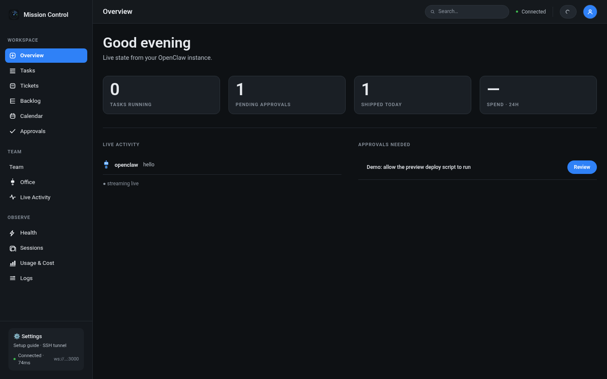
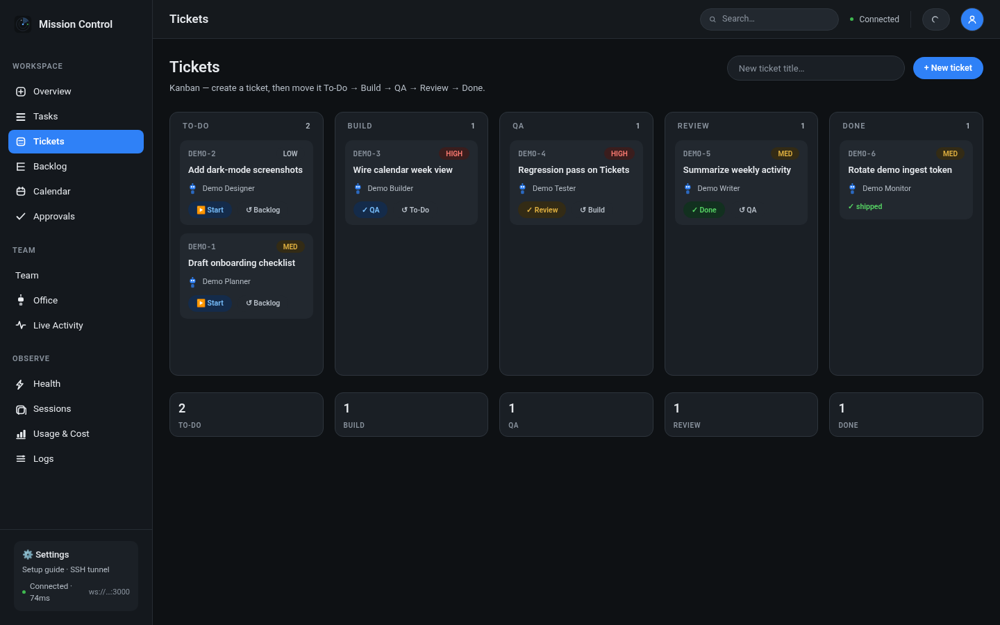

# Mission Control

**Self-hostable command center for agent orchestration.** Manage tickets and tasks, review approvals, watch a live Office floor and calendar of cron jobs, and stream real agent activity — either from your OpenClaw instance via the vendored bridge, or from the built-in demo seed on a cold clone.

Works standalone: `docker compose up --build` → `npm run seed:demo` → open the dashboard. No OpenClaw required to explore the UI.

**Status:** 15 web pages (14 dashboard routes + `/#/connect` onboarding), NestJS API (15 controllers) with Socket.IO live feed, 9 Prisma models, vendored OpenClaw bridge, idempotent demo seed, MIT license. Clone-and-run via Docker.

> **Hash routes:** the web app uses React `HashRouter`. Deep links look like `http://localhost:5173/#/tickets`. A plain path such as `/tickets` (no hash) falls through to Overview — always use `/#/…` URLs.

---

## Screenshots (seeded demo)

After `npm run seed:demo`, the Board, Calendar, Team, and Office are populated with generic sample data:

| Overview | Tickets board |
| --- | --- |
|  |  |

| Calendar | Team |
| --- | --- |
|  |  |

---

## Quickstart

Prereqs: Docker + Docker Compose, Node 20.17+ (or 22.9+), npm, git.

```bash
git clone https://github.com/jaysinghcodes/mission-control.git
cd mission-control
npm ci
cp .env.example .env          # replace INGEST_TOKEN=change-me with your own (blank → compose uses dev-ingest-token)
docker compose up --build     # Postgres :5432, API :3000, web :5173
npm run seed:demo             # optional but recommended — sample agents/tickets/calendar
```

Open **http://localhost:5173/#/** — green "Connected" dot in the topbar means the live socket is up.

| Service | URL |
| --- | --- |
| Web (dashboard) | http://localhost:5173/#/ |
| API health | http://localhost:3000/health |
| Tickets board | http://localhost:5173/#/tickets |
| Calendar | http://localhost:5173/#/calendar |
| Team / Office | http://localhost:5173/#/team · http://localhost:5173/#/office |

### Operator name (optional)

Set `OPERATOR_NAME` in the root `.env` (display only — **not** a secret, never used for auth). Compose passes it to the API and bakes it into the web bundle as `VITE_OPERATOR_NAME`. Blank → neutral first run (`Good evening` / default assignee `Operator`).

For non-Docker `npm run dev`, also set `VITE_OPERATOR_NAME` (Vite only exposes `VITE_*` to the browser).

---

## What this is

| App | Path | Stack | Role |
| --- | --- | --- | --- |
| `web` | [`apps/web`](apps/web) | React 19 + Vite 8 + Tailwind CSS v4 | 14 dashboard routes (Overview, Tasks, Tickets, Backlog, Calendar, Approvals, Team, Office, Activity, Health, Sessions, Usage, Logs, Settings) + `/#/connect` onboarding = 15 pages |
| `api` | [`apps/api`](apps/api) | NestJS 11 + Socket.IO + Prisma 7 (Postgres) | REST + live event bus, ticket/run lifecycle, ingest for the OpenClaw bridge |
| `bridge` | [`bridge`](bridge) | Python 3 stdlib | Optional OpenClaw → Mission Control sync (`mc-bridge-sync.py`) |

### Pages (15)

Workspace: Overview · Tasks · Tickets · Backlog · Calendar · Approvals  
Team: Team · Office · Live Activity  
Observe: Health · Sessions · Usage & Cost · Logs · Settings  
Onboarding: Connect (`/#/connect`)

### Data model (9 Prisma models)

`Agent` · `Run` · `Ticket` · `Session` · `CronJob` · `UsageSnapshot` · `ActivityEvent` · `Approval` · `ModelConfig`

Migrations are a security red line: schema changes are human-reviewed and never auto-applied by the app. Compose runs `prisma migrate deploy` on api boot.

---

## Architecture

```
┌─────────────────────────────┐         ┌──────────────────────────────────────────┐
│         OpenClaw            │         │              Mission Control             │
│  (agent runtime, cron jobs) │         │                                          │
│                             │         │  ┌──────────────┐   Socket.IO (WS)   ┌───┴───────┐
│  bridge/mc-bridge-sync.py   │────────▶│  │   api :3000  │──────────────────▶ │  web:5173 │
│  (every ~5m, optional)      │  POST   │  │              │  broadcast events  │  React UI │
│                             │  /events│  │  ingest →     │                    │  15 pages │
└─────────────────────────────┘  token  │  │  gateway →    │◀── hello / health  │  (hash)   │
                                        │  │  socket.io    │    tick (30s)      └──────────┘
                                        │  │  Prisma 7 +   │
                                        │  │  Postgres     │
                                        │  └──────────────┘
                                        └────────────────────────────────────────┘
```

Without OpenClaw, `npm run seed:demo` fills agents, cron jobs, tickets, activity, and a pending approval so Board / Calendar / Team / Office are clickable.

### Event flow

1. **Producers** — the vendored [`bridge/`](bridge/README.md) (or any trusted client) POSTs typed events to `POST /events` with `x-ingest-token`.
2. **Ingest** — validates token + closed event-type union; rejects unknowns (400) and unauthenticated requests (401, fail-closed in production).
3. **Gateway** — broadcasts to every connected Socket.IO client with a server timestamp; events also persist as `ActivityEvent`.
4. **Dashboard** — `useLiveActivity` keeps recent events; topbar connection dot is honest (green only when the socket is up).

### Security posture

- **Loopback by default** — API binds `127.0.0.1` locally; compose publishes only on `127.0.0.1`.
- **Fail-closed auth** — production needs `DATABASE_URL`; socket needs `SOCKET_TOKEN`; ingest needs `INGEST_TOKEN`.
- **Locked CORS** — HTTP + WS locked to `WEB_ORIGIN` (never `*`).
- **No secrets in code** — see [`.env.example`](.env.example).

---

## Running locally

### Docker (clone-and-run)

```bash
cp .env.example .env
docker compose up --build
npm run seed:demo
# → http://localhost:5173/#/
```

- Postgres 16 on `127.0.0.1:5432` (volume `mc-db`)
- API on `http://localhost:3000` (`prisma migrate deploy` on boot)
- Web on `http://localhost:5173`

### Manual (no Docker)

Prereqs: Node 20+, npm, Postgres 16.

```bash
npm ci
(cd apps/api && npx prisma generate)
# create DB, then:
(cd apps/api && npx prisma migrate deploy)
cp .env.example .env
set -a; . ./.env; set +a          # api has no .env loader — export into the shell
npm run dev                       # turbo: api + web
```

### Build / test / lint

```bash
npm run build
npm test              # api jest unit tests (no DB)
npm run test:e2e      # needs migrated Postgres at DATABASE_URL
npm run lint
```

---

## OpenClaw integration (optional)

Fed by OpenClaw through the vendored bridge — see [`bridge/README.md`](bridge/README.md):

```bash
python3 bridge/mc-bridge-sync.py            # one sync; reads INGEST_TOKEN from root .env
python3 bridge/mc-bridge-sync.py --dry-run  # print events, post nothing
```

Schedule every ~5 minutes (system cron or an OpenClaw cron job). Each run can post `agents.snapshot`, `sessions.snapshot`, `calendar.snapshot`, `usage.snapshot`, `approvals.snapshot`, and `run.*` events.

**What works without OpenClaw / the bridge**

- Tickets loop: Backlog → To-Do → Build → QA → Review → Done (persisted)
- Seeded demo Calendar, Team, Office, Activity, Approvals
- Overview KPIs from the API + live socket (`hello` / `health.tick`)

**What needs the bridge**

- Live roster / cron jobs / sessions / usage from a real OpenClaw instance
- Live `run.*` movement on the Office floor from real cron runs
- Live Activity enriched by real agent work (ticket moves still emit `run.*` locally)

---

## Layout

```
apps/web/                  React dashboard (HashRouter, 15 pages)
apps/api/                  NestJS backend + Prisma schema (9 models)
bridge/                    OpenClaw → Mission Control sync (optional)
design/                    IA flow, wireframes, design tokens
docs/screenshots/          Seeded-demo PNGs embedded above
logos/                     Brand explorations
ONBOARDING.md              Guided install (agent-pasteable)
```

---

## Dev workflow

- **No direct merges to `main`** — everything lands via PR.
- Merge → delete the source branch (local and remote).
- Keep PRs small; heavy inline comments on new code.
- Security red lines: auth, DB schema, and secrets are human-reviewed line by line.

## Roadmap

1. ✅ Monorepo + design tokens + Overview shell
2. ✅ NestJS API, Socket.IO gateway, Prisma, health
3. ✅ Live activity feed (web ↔ socket)
4. ✅ Tickets kanban, Tasks/runs, Approvals, Calendar, Team, Office, Observe pages
5. ✅ OpenClaw ingest + health ticker + vendored `bridge/`
6. ✅ Idempotent `seed:demo` for clone-without-OpenClaw
7. ✅ OSS reposition — MIT, neutral operator config (`OPERATOR_NAME`), docs/screenshots
8. 🔜 Next: see open issues / PRs
